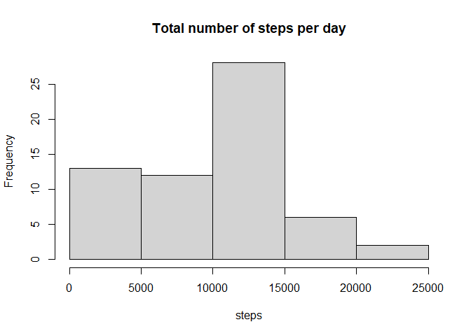
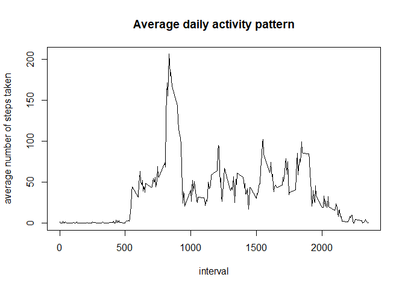
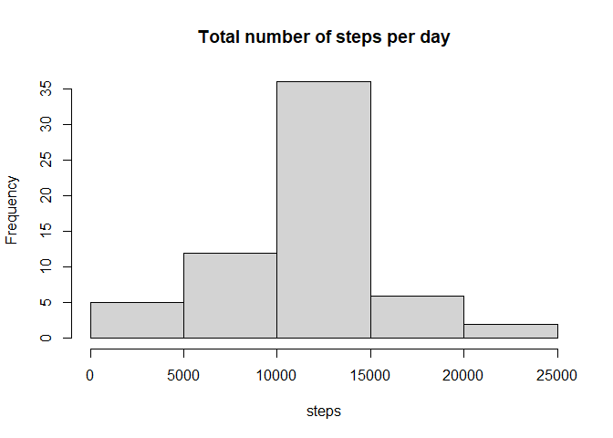
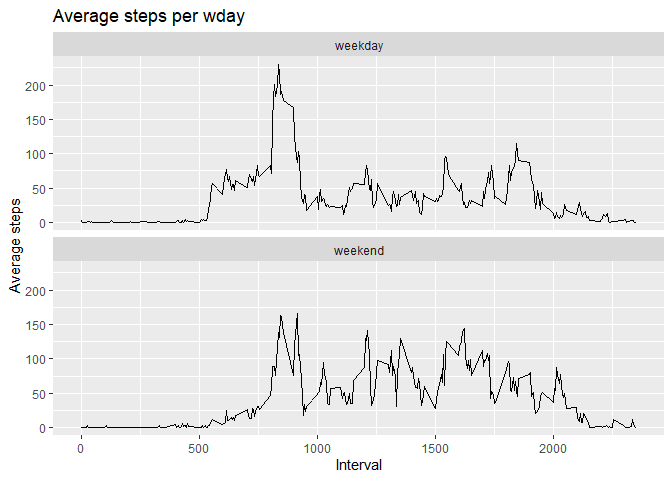

## Loading and preprocessing the data
1. Load the data (i.e. `read.csv()`)
  


```r
dat <- read.csv("./activity/activity.csv")
```
  
2. Process/transform the data (if necessary) into a format suitable for your analysis
  
1)Process
  

```r
str(dat)
```

```
## 'data.frame':	17568 obs. of  3 variables:
##  $ steps   : int  NA NA NA NA NA NA NA NA NA NA ...
##  $ date    : chr  "2012-10-01" "2012-10-01" "2012-10-01" "2012-10-01" ...
##  $ interval: int  0 5 10 15 20 25 30 35 40 45 ...
```

```r
head(dat)
```

```
##   steps       date interval
## 1    NA 2012-10-01        0
## 2    NA 2012-10-01        5
## 3    NA 2012-10-01       10
## 4    NA 2012-10-01       15
## 5    NA 2012-10-01       20
## 6    NA 2012-10-01       25
```

```r
summary(dat)
```

```
##      steps            date              interval     
##  Min.   :  0.00   Length:17568       Min.   :   0.0  
##  1st Qu.:  0.00   Class :character   1st Qu.: 588.8  
##  Median :  0.00   Mode  :character   Median :1177.5  
##  Mean   : 37.38                      Mean   :1177.5  
##  3rd Qu.: 12.00                      3rd Qu.:1766.2  
##  Max.   :806.00                      Max.   :2355.0  
##  NA's   :2304
```
  
2)Transform : For convenience, I will use lubridate package to transform date column into date format, since it is on chr now.
  

```r
library(lubridate)
```

```
## 
## Attaching package: 'lubridate'
```

```
## The following objects are masked from 'package:base':
## 
##     date, intersect, setdiff, union
```

```r
dat$date <- ymd(dat$date)
```

## What is mean total number of steps taken per day?
For this part of the assignment, you can ignore the missing values in
the dataset.

1. Make a histogram of the total number of steps taken each day


```r
tnsted <- aggregate(dat$steps,list(dat$date), sum,na.rm =TRUE)
names(tnsted) <- c("date","steps")
hist(tnsted$steps, main = "Total number of steps per day", xlab="steps")
```

<!-- -->
  
2. Calculate and report the **mean** and **median** total number of steps taken per day
  

```r
mean(tnsted$steps)
```

```
## [1] 9354.23
```

```r
median(tnsted$steps)
```

```
## [1] 10395
```


## What is the average daily activity pattern?
1. Make a time series plot (i.e. `type = "l"`) of the 5-minute interval (x-axis) and the average number of steps taken, averaged across all days (y-axis)


```r
anstd <- aggregate(dat$steps, list(dat$interval), mean, na.rm =TRUE)
names(anstd) <- c("interval", "stepmean")
plot(anstd$interval, anstd$stepmean, type = "l" ,main = "Average daily activity pattern", xlab = "interval", ylab = "average number of steps taken")
```

<!-- -->
  
2. Which 5-minute interval, on average across all the days in the dataset, contains the maximum number of steps?
  

```r
anstd$interval[which.max(anstd$stepmean)]
```

```
## [1] 835
```

## Imputing missing values
Note that there are a number of days/intervals where there are missing
values (coded as `NA`). The presence of missing days may introduce
bias into some calculations or summaries of the data.

1. Calculate and report the total number of missing values in the dataset (i.e. the total number of rows with `NA`s)


```r
sum(is.na(dat))
```

```
## [1] 2304
```
  
2. Devise a strategy for filling in all of the missing values in the dataset. The strategy does not need to be sophisticated. For example, you could use the mean/median for that day, or the mean for that 5-minute interval, etc.

 I will take simple strategy of substituting NA value with the mean of that particular interval.

 To achieve this, I will follow three steps.
  1)Find missing values in the set with is.na
  2)by using vector multiplication in r, which would repeat if the size of
  x is divided by size of y, I would make a vector 'altered' that is a vec
  -tor of missing values being altered to that of mean
  3)I would put this values to original NA values
  

3. Create a new dataset that is equal to the original dataset but with the missing data filled in.
  

```r
dat1 <- dat
missing <- is.na(dat1$steps)
altered <- as.vector(missing) * as.vector(anstd$stepmean)
dat1$steps[missing] <- 0
dat1$steps <- dat1$steps + altered
```
  
4. Make a histogram of the total number of steps taken each day and Calculate and report the **mean** and **median** total number of steps taken per day. Do these values differ from the estimates from the first part of the assignment? What is the impact of imputing missing data on the estimates of the total daily number of steps?
  
1)Make a histogram of the total number of steps taken each day.
  

```r
tnsted1 <- aggregate(dat1$steps, list(dat1$date), sum)
names(tnsted1) <- c("date","steps")
hist(tnsted1$steps, main = "Total number of steps per day", xlab="steps")
```

<!-- -->
  
2)Calculate and report the **mean** and **median** total number of steps taken per day.
  

```r
mean(tnsted1$steps)
```

```
## [1] 10766.19
```

```r
median(tnsted1$steps)
```

```
## [1] 10766.19
```
  
  3)Do these values differ from the estimates from the first part of the assignment?
  
  yes
  
  4)What is the impact of imputing missing data on the estimates of the total daily number of steps?
  
  It has increased the mean a bit.
  
## Are there differences in activity patterns between weekdays and weekends?
For this part the `weekdays()` function may be of some help here. Use
the dataset with the filled-in missing values for this part.

1. Create a new factor variable in the dataset with two levels -- "weekday" and "weekend" indicating whether a given date is a weekday or weekend day.


```r
dat1$wday <- 0
dat1$wday[which(wday(dat1$date) == 1 | wday(dat1$date) == 7)] <- "weekend"
dat1$wday[which(dat1$wday == 0)] <- "weekday"
factor(dat1$wday)
```

1. Make a panel plot containing a time series plot (i.e. `type = "l"`) of the 5-minute interval (x-axis) and the average number of steps taken, averaged across all weekday days or weekend days (y-axis). The plot should look something like the following, which was created using


```r
library(ggplot2)
last <- aggregate(steps ~ interval + wday, data = dat1, mean)
names(last) <- c("interval", "wday", "stepmean")
ggplot(last, aes(x = interval , y = stepmean)) + geom_line() + 
labs(title = "Average steps per wday", x = "Interval", y = "Average steps") + facet_wrap(~wday, ncol = 1, nrow=2)
```

<!-- -->

  
  
